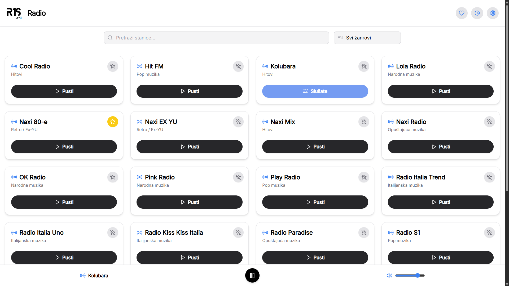
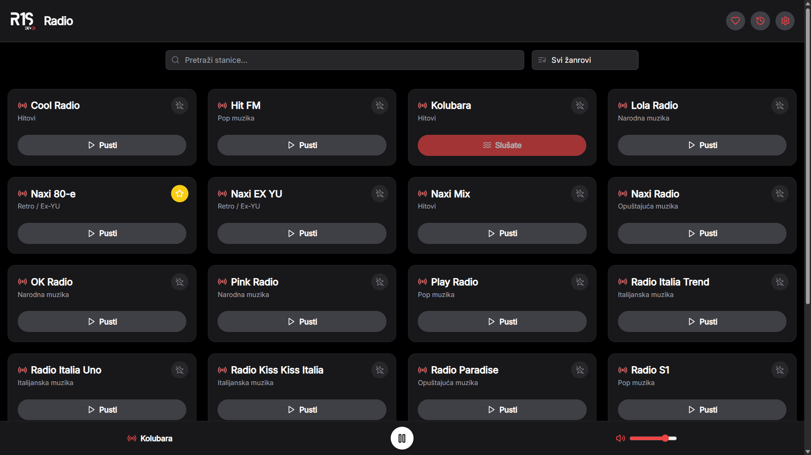
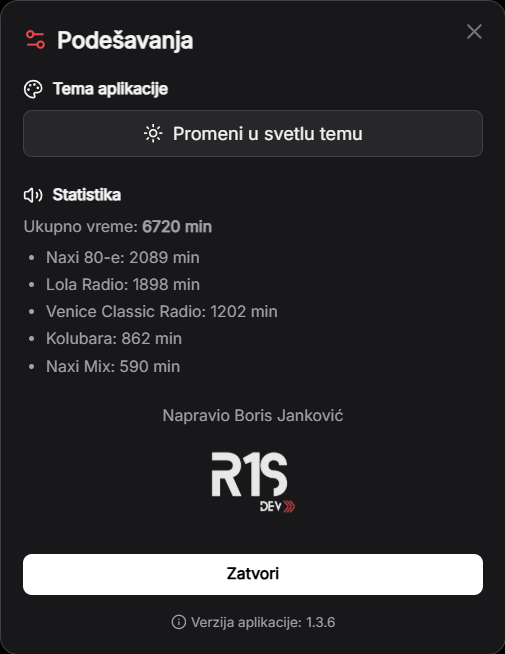

# 🎧 R1S Radio

Brza i lagana web aplikacija za slušanje radio stanica iz Srbije.  
Razvijena kao **Progressive Web App (PWA)** sa fokusom na performanse, lokalno čuvanje podataka i prilagodljiv interfejs za **desktop i mobilne uređaje**.

🔗 **Live demo:**  
👉 https://r1s-radio.vercel.app

---

## 📸 Pregled aplikacije

### Desktop – Light / Dark



### Podešavanja & Statistika (Desktop)


> Aplikacija je u potpunosti optimizovana za mobilne uređaje i dostupna kao PWA  
> (Light/Dark tema, fullscreen režim, instalacija na početni ekran).

---

## ⚙️ Funkcionalnosti

- Pretraga i filtriranje radio stanica
- Dodavanje stanica u favorite (lokalno čuvanje)
- Statistika slušanja:
  - poslednje slušano
  - najčešće slušano
  - ukupno vreme slušanja
- Sekcija **Podešavanja**:
  - pregled statistike
  - upravljanje favoritima
- **Light / Dark tema**:
  - automatsko praćenje sistemskih podešavanja
  - ručni izbor teme
- **PWA podrška**:
  - instalacija na početni ekran (PC i mobilni)
  - fullscreen režim rada
- Trenutno **24 radio stanice**, uz kontinuirano dodavanje novih

---

## 🧩 Tehnologije

- **[React](https://react.dev/)** – izrada korisničkog interfejsa  
- **[TypeScript](https://www.typescriptlang.org/)** – tipizacija i sigurnost koda  
- **[Tailwind CSS](https://tailwindcss.com/)** – stilizacija i responsive dizajn  
- **[Framer Motion](https://www.framer.com/motion/)** – animacije i tranzicije  
- **[Vite](https://vitejs.dev/)** – razvojni i build alat  
- **[LocalStorage](https://developer.mozilla.org/en-US/docs/Web/API/Window/localStorage)** – klijentsko čuvanje podataka  
- **[Progressive Web Apps](https://developer.mozilla.org/en-US/docs/Web/Progressive_web_apps)** – offline podrška i instalacija aplikacije  

---

## 🏗️ Arhitektura i rad sa podacima

- Potpuno klijentska aplikacija (bez backend-a)
- **Local-first** pristup (podaci ostaju na uređaju korisnika)
- Centralizovano upravljanje stanjem aplikacije
- Responsivan UI optimizovan za desktop i mobilne uređaje

---

## 🚀 Pokretanje lokalno

```bash
git clone https://github.com/R1S-dev/R1S-Radio.git
cd R1S-Radio
npm install
npm run dev
