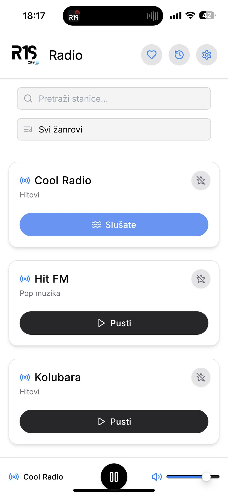
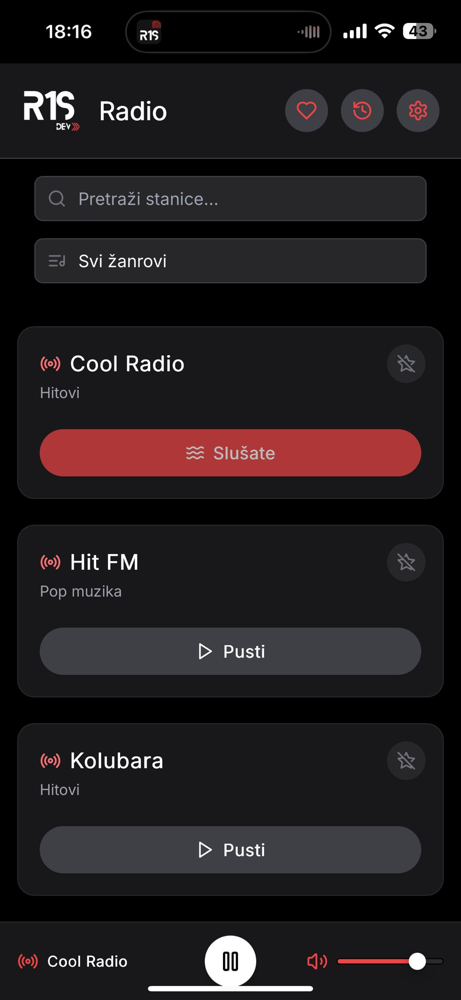

# 🎧 R1S Radio

Brza i lagana web aplikacija za slušanje radio stanica iz Srbije.  
Razvijena kao **PWA (Progressive Web App)**, aplikacija radi jednako dobro na **računaru i mobilnim uređajima**, uz lokalno čuvanje podataka i bez potrebe za korisničkim nalogom.

🌐 Live demo: https://r1s-radio.vercel.app

---

## 📸 Pregled aplikacije

### Desktop – Light / Dark


### Mobile – Light / Dark



### Podešavanja & Statistika (Desktop)


---

## ⚙️ Funkcionalnosti

- Pretraga i filtriranje radio stanica
- Dodavanje stanica u favorite (lokalno čuvanje)
- Statistika slušanja:
  - poslednje slušano
  - najčešće slušano
  - ukupno vreme slušanja
- Sekcija **Podešavanja**:
  - pregled statistike slušanja
  - upravljanje favoritima
- **Light / Dark tema**:
  - automatsko praćenje sistemskih podešavanja
  - ručni izbor teme
- **PWA podrška**:
  - instalacija na početni ekran (PC i mobilni)
  - fullscreen režim rada
- Trenutno **24 radio stanice**, uz stalno dodavanje novih

---

## 🧩 Tehnologije

- React
- TypeScript
- Tailwind CSS
- Framer Motion
- Vite
- LocalStorage (klijentsko čuvanje podataka)
- PWA (Service Worker, keširanje)

---

## 🏗️ Arhitektura i rad sa podacima

- Potpuno klijentska aplikacija (bez backend-a)
- Local-first pristup
- Sva korisnička podešavanja i statistika čuvaju se u browseru
- Centralizovano stanje aplikacije
- Responsivan UI prilagođen desktop i mobilnim uređajima

---

## 🚀 Pokretanje lokalno

```bash
git clone https://github.com/R1S-dev/R1S-Radio.git
cd R1S-Radio
npm install
npm run dev
